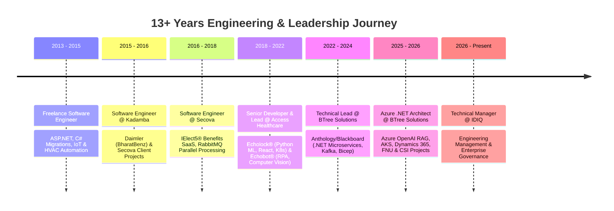

# Hi there, I'm Promodh Kumar 👋
### Technical Manager • Azure .NET Cloud Solutions Architect • Full-Stack MEARN & AI Engineer

  

---

### 👨‍💻 Executive Summary

I am a **Technical Manager**, **Azure Cloud Solutions Architect**, and **Microsoft Certified Professional (MCPS)** with **13+ years of expertise** driving scalable digital transformation, enterprise software modernization, and cloud-native solutions across **Multi-Cloud (Azure & AWS)** environments.

Currently serving as **Technical Manager at IDIQ**, my career encompasses architecting high-concurrency microservices, orchestrating zero-downtime Kubernetes deployments, integrating **Azure OpenAI (RAG with Guard Rails)**, and engineering secure SaaS platforms in heavily regulated sectors including **EdTech (FERPA)**, **FinTech/Payments**, and **Healthcare (HIPAA / HITRUST / HL7 / FHIR)**.

* 🏢 **Current Role**: Technical Manager @ **IDIQ**.
* 🏛️ **Architectural Lineage**: Ex-Azure .NET Architect & Technical Lead @ **BTree Solutions** (leading high-impact initiatives for *Anthology/Blackboard*, *Florida National University*, and *College of Southern Idaho*), **Access Healthcare**, **Secova**, and **Kadamba** (*Daimler/BharatBenz*).
* ⚡ **Core Philosophy**: Decoupled clean architecture, resilient event-driven systems (Kafka, RabbitMQ, Azure Service Bus), zero-downtime releases (Blue-Green/Canary), and strict Infrastructure as Code governance.
* 🤖 **AI & Innovation**: Production Generative AI via Azure OpenAI RAG pipelines, ML.NET predictive trend analysis, and Python anomaly detection engines.
* 🌐 **Founder & Advisory Director**: Strategic technology governance at **IProGs Solutions** and author at [godfatherpromodh.me](https://godfatherpromodh.me).

---

### 🏆 Certifications & Professional Accreditations

[-0078D4?style=for-the-badge&logo=microsoft&logoColor=white)](https://learn.microsoft.com)

---

### 🛠️ Technology Radar & Enterprise Toolbox

#### ☁️ Cloud Architecture & Infrastructure as Code (IaC)

-4285F4?style=flat-square&logo=google-cloud&logoColor=white)
-326CE5?style=flat-square&logo=kubernetes&logoColor=white)

#### 🚀 Backend, Distributed Systems & Messaging

#### 🎨 Full-Stack Frontend Engineering (MEARN / Modern SPA)

#### 🤖 AI, Machine Learning & Analytics
-0089D6?style=flat-square&logo=openai&logoColor=white)

#### 💾 Databases & In-Memory Stores

---

### 💼 Career Snapshot & Milestone Highlights

---

### 🌟 Featured Flagship Platforms & Repositories

<table>
  <tr>
    <td width="50%" valign="top">
      <h4>💬 <a href="https://github.com/promodhvkumar/MatesUp_Angular_App">MatesUp Real-Time Social Platform</a></h4>
      
Decoupled real-time social networking and chatroom platform showcasing high-concurrency architecture.

      <ul>
        <li><b>Frontend</b>: <a href="https://github.com/promodhvkumar/MatesUp_Angular_App">Angular 19 SPA</a> with CoreUI & SignalR WebSockets.</li>
        <li><b>Backend</b>: <a href="https://github.com/promodhvkumar/Matesup_Core_Api">ASP.NET Core 8 Web API</a> with EF Core & NLog.</li>
        <li><b>Heritage</b>: <a href="https://github.com/promodhvkumar/Matesup_dotnet_legacy">.NET Framework 4.6.1 Monolith</a> reference baseline.</li>
      </ul>
    </td>
    <td width="50%" valign="top">
      <h4>🏢 <a href="https://iprogs.in">IProGs Solutions Portal</a></h4>
      
Corporate technology showcase and digital gateway for IProGs Solutions, demonstrating full-stack engineering consultancy and enterprise delivery.

      <ul>
        <li>Multi-cloud automated CI/CD via Azure DevOps & GitHub Actions.</li>
        <li>Explicit SSL FTPS automated pipeline to IIS web servers.</li>
      </ul>
    </td>
  </tr>
  <tr>
    <td width="50%" valign="top">
      <h4>☸️ <a href="https://github.com/promodhkumarvenugopal/Docker">Cloud-Native & Kubernetes Orchestration Lab</a></h4>
      
Comprehensive DevOps laboratory implementing multi-tier architectures, persistent volumes, and declarative Kubernetes cluster manifests.

      <ul>
        <li>3-replica Kubernetes Deployments & LoadBalancer Services.</li>
        <li>Production Firefly III financial suite, MariaDB & Redis caching.</li>
      </ul>
    </td>
    <td width="50%" valign="top">
      <h4>✍️ <a href="https://godfatherpromodh.me">Godfather Promodh Blog</a></h4>
      
Personal brand and technology publishing platform featuring engineering retrospectives, cloud architecture guides, and digital thought leadership.

      <ul>
        <li>WordPress CMS deployment with disaster-recovery SQL snapshot.</li>
        <li>Explore articles at <a href="https://godfatherpromodh.me">godfatherpromodh.me</a>.</li>
      </ul>
    </td>
  </tr>
</table>

---

### 📊 GitHub Telemetry & Activity Metrics

  
  

  

---

  <i>"Simplicity is prerequisite for reliability." — Promodh Kumar</i>

